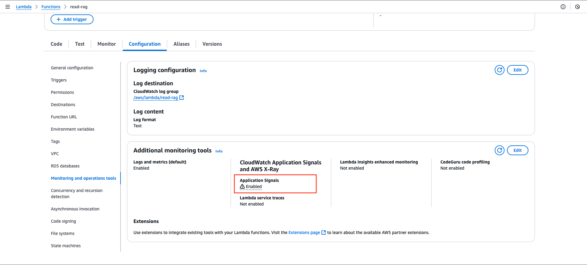
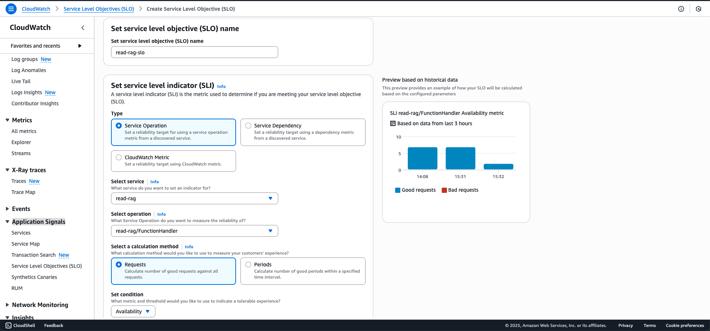
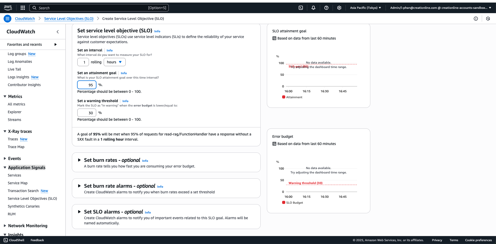

# Setting Up and Monitoring SLO/SLI with AWS CloudWatch Application Signals

## Overview

AWS system monitoring often focuses only on basic metrics like 5xx errors at Load Balancer or API Gateway. However, as systems grow, establishing SLO (Service Level Objectives) and SLI (Service Level Indicators) becomes essential to ensure service quality and detect issues early.

This article guides you through setting up SLO/SLI for serverless systems using AWS CloudWatch Application Signals - an integrated monitoring solution within the AWS ecosystem.

## Advantages of CloudWatch Application Signals

Compared to SaaS solutions like Grafana, CloudWatch Application Signals offers several benefits:

- Enhanced security by not sharing data with third parties
- Centralized management within the AWS environment
- Seamless integration with other AWS services

## Sample System Architecture

This is the architecture I used for demonstration in this blog. Details about the system can be found in the link below.

Architecture details: [Qitta Blog](https://qiita.com/phandinhloccb/items/3368c44c68999e64f736)

## Establishing SLO/SLI Targets

For a serverless system with 3 Lambda services, we set the following targets:

| Component | Value |
|-----------|-------|
| SLO evaluation period | 1 hour (rolling) |
| Calculation method | Requests |
| SLO target | 95% successful requests |
| Warning threshold | 30% of error budget |
| Estimated requests/hour | ~200 |

### Detailed Analysis

**SLO 95% success rate:**
- Allows maximum 5% error requests
- With 200 requests/hour: maximum 10 error requests allowed

**Error Budget:**
- Total error budget = 5% = 10 errors/hour
- Warning threshold = 30% of 10 errors = 3 errors
- When errors ≥ 3: SLO status becomes "Warning"
- When errors > 10: SLO becomes Unhealthy

## Practical Implementation

### 1. Activating Application Signals

In Lambda configuration, go to the **Monitoring and operations tools** section and enable **Application Signals**:

Lambda will automatically create necessary policies and attach them to the Lambda role for pushing metrics. After activation, wait for the system to collect data and display the dashboard:

### 2. Setting up SLI

#### Comparing SLI Calculation Methods

| Criteria | Request-based | Time-based (Periods) |
|----------|---------------|----------------------|
| Reflecting user experience | ✅ High accuracy | 🔸 Less accurate with high traffic |
| Fault tolerance | ❌ Sensitive to minor errors | ✅ Tolerates temporary errors |
| Suitability for low traffic | ❌ Not suitable | ✅ Very suitable |
| Detecting prolonged errors | ❌ Less effective | ✅ Highly effective |
| Ease of understanding | ✅ Easy to understand (995/1000) | 🔸 Harder to understand (9/12 periods) |

#### Illustrative Example of the Difference

Suppose a system over 3 minutes has:

| Time | Total requests | Error requests | Minute status |
|------|---------------|----------------|---------------|
| 10:00–10:01 | 10,000 | 300 | ✅ Good (3% errors) |
| 10:01–10:02 | 10,000 | 200 | ✅ Good (2% errors) |
| 10:02–10:03 | 10,000 | 600 | ✅ Good (6% errors - assuming 10% threshold) |
| **Total** | **30,000** | **1,100** | **Period-based SLI: 100% Good**   **Request-based SLI: 96.3% Good** |

**Results:**
- Using Periods: System appears perfect (3/3 minutes achieved)
- Using Requests: 1,100 errors (3.7%) - reflects actual user experience

#### When to Use Time-based (Periods)

Periods are suitable for **low traffic** (less than a few hundred requests/hour):

**With 200 requests/hour:**
- 1 error = 0.5% error rate
- 2 errors = 1% error rate → easily violates SLO if using Request-based

**With Period-based:**
- 1 hour divided into 60 periods (1 minute/period)
- If only 1 minute has errors, while 59 minutes are good → SLO = 59/60 = 98.3% (still meets target)

Periods help make the system less affected by short-term errors, suitable for low-traffic environments.

### 3. Setting up SLO

### 4. Setting up Alarms

CloudWatch Application Signals supports 3 types of alarms:

1. **SLI Health alarm**: Alerts when SLI doesn't meet the threshold in real-time
2. **SLO attainment goal alarm**: Alerts when the SLO target isn't achieved
3. **SLO warning alarm**: Alerts when too much error budget is consumed

**SLI Health alarm** uses data based on a sliding window:
- AWS uses a short time window (typically 1-5 minutes)
- Calculates the ratio of good requests/total requests in the most recent window
- Compares against the set SLO target

When setting up alarms, AWS automatically creates the corresponding CloudWatch alarms.

## Results
### Understanding SLO Reports

| Field | Value | Meaning |
|-------|-------|---------|
| SLO name | response-slack-slo | The name given to the SLO |
| Goal | 95% | Target: 95% successful requests |
| SLI status | Unhealthy | SLI is not meeting the target |
| Latest attainment | 93.9% | Current success rate (< 95%) |
| Error budget | 1 requests over budget | Exceeded the allowed error budget |
| Error budget delta | -25% | Consumed 25% more error budget compared to before |
| Time window | 1 hour rolling | Continuous evaluation over the most recent hour |

✅ **SLO Goal: 95%**
This is your target: at least 95% of requests must meet success criteria (e.g., HTTP 2xx, response time < 1s...).
If attainment is below 95%, the system is considered in violation of the SLO.

🚦 **SLI status: Unhealthy**
This means: Based on data from the past hour, the system is not achieving the SLO.
This indicates the health status of the SLI, not a "software error."

📊 **Latest attainment: 93.9%**
In the most recent hour (rolling window), you've only achieved 93.9% successful requests.
This is < 95%, meaning the SLO requirement is not met.

❗ **Error budget: 1 request over budget**
You've exceeded the allowable error limit according to the SLO.
If the SLO allows 5% errors in 1000 requests (i.e., 50 errors), then:
You've experienced 51 errors → 1 request over the error budget.
This officially violates the SLO.

🔻 **Error budget delta: -25%**
This is the change compared to the previous period:
It means you've consumed an additional 25% of your error budget (compared to the previous cycle or snapshot).
This could be due to a recent spike in errors.
The purpose of the delta is to quickly detect negative trends.

🕐 **Time window: 1 hour rolling**
The SLO is calculated based on a continuous rolling 1-hour window.
Every minute, the system looks back at the previous 60 minutes to recalculate all metrics.

## Detailed Monitoring
### Tracking Specific Requests

Beyond overall monitoring, you can set up SLOs for individual request types:
For example: In the read-rag service, you can establish separate SLOs for requests to Bedrock and OpenSearch based on latency or error rates.

### Service Map

Service Map helps visualize the entire system and identify services that aren't meeting SLOs:

| Metric | Value |
|--------|-------|
| Requests | 9 |
| Avg latency | 655.9 ms |
| Error rate | 0% |
| Fault rate | 0% |

#### Comparing Service Map and Trace Map (X-ray)

| Criteria | Service Map | Trace Map |
|----------|-------------|-----------|
| Purpose | System overview and relationships | Details of a single request from start to finish |
| Scope | Entire system | Single request |
| Usage | - Finding system bottlenecks - Viewing service interactions - Monitoring overall health | - Debugging a specific error - Analyzing detailed latency - Tracking processing flow |
| Display | Graph of services and connections | Timeline or span tree |
| Data source | Multiple traces + aggregated metrics | A single trace |
| Example | Service A → B → C with B having high latency | Trace ID xyz: API → Lambda → DynamoDB → S3 |

## Conclusion

AWS CloudWatch Application Signals is an effective solution for AWS systems, providing monitoring and alerting when SLO/SLI targets aren't met without requiring third-party tools. 