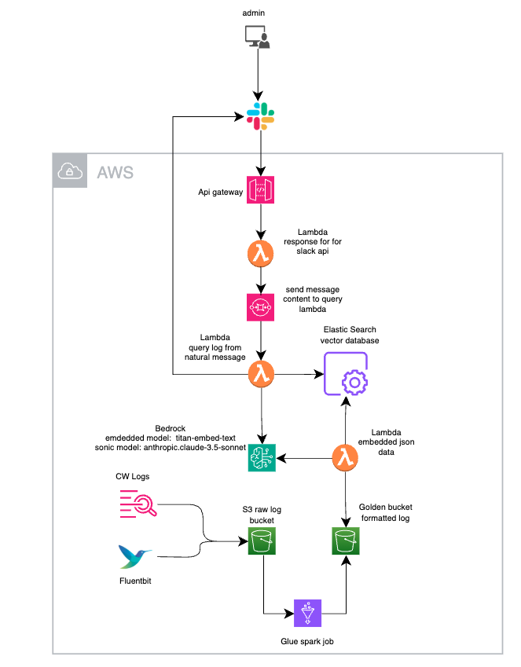
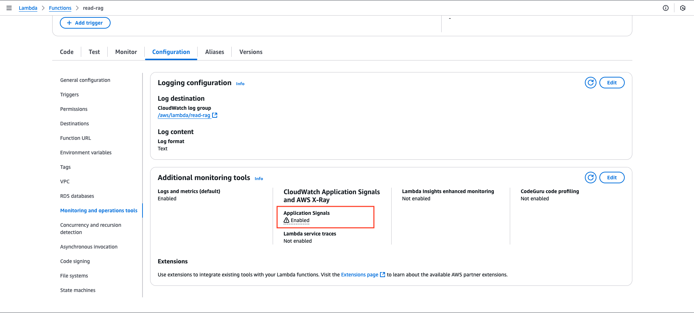
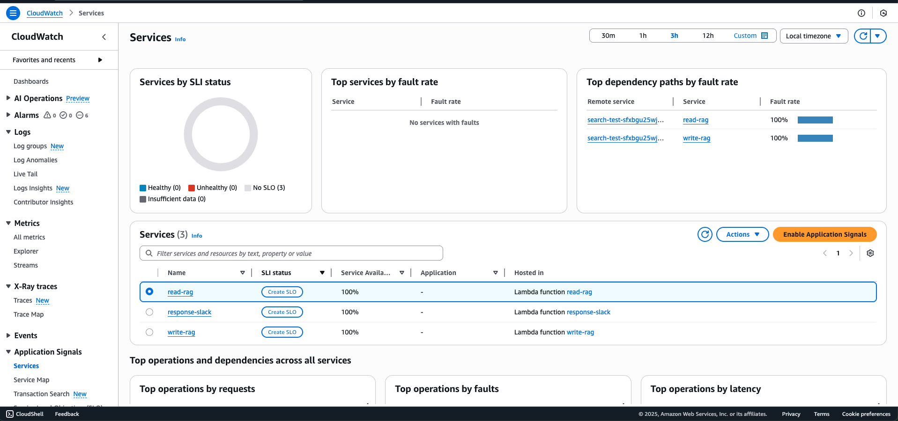
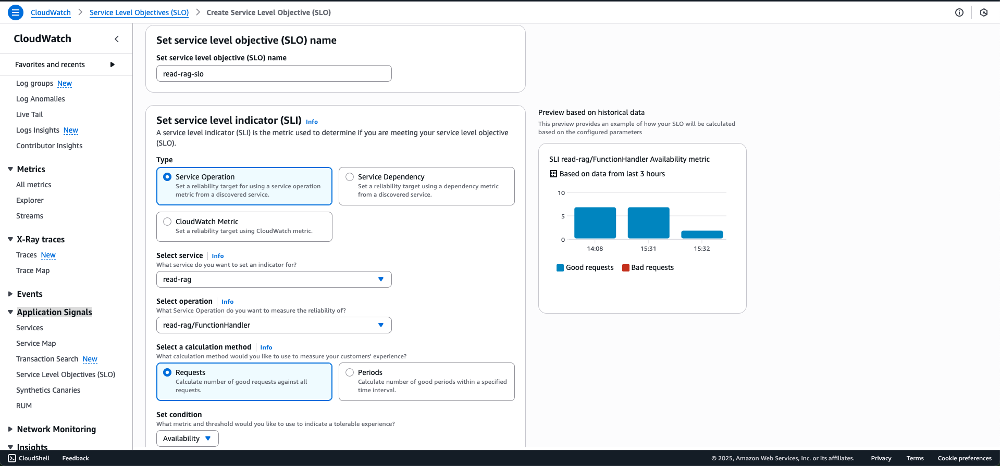
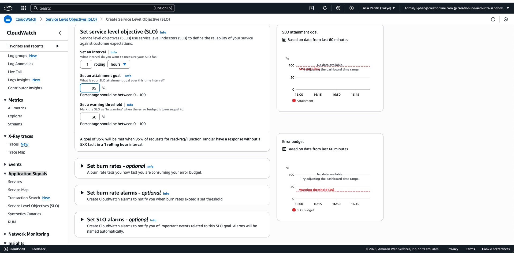
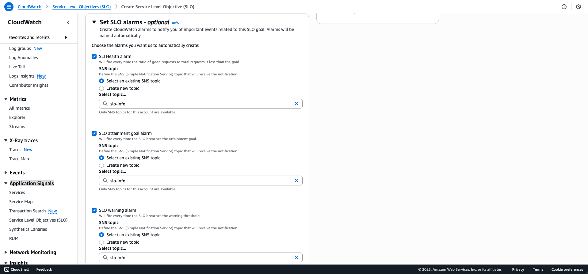
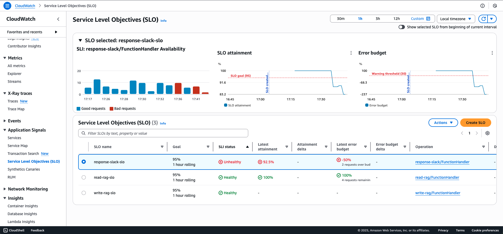
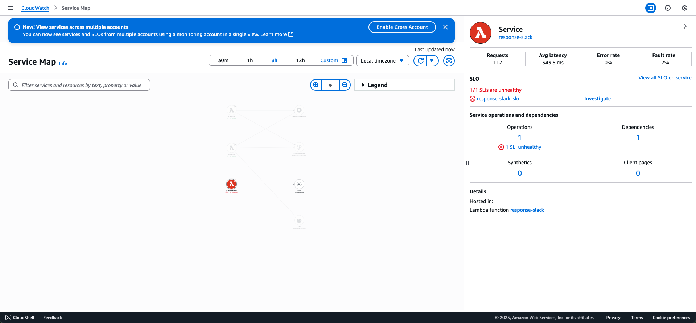

# AWS CloudWatch Application SignalsでSLO/SLIの設定とモニタリング

## 概要

AWSシステムのモニタリングは、LoadBalancerやAPI Gatewayでの5xxエラーなどの基本的なメトリクスに焦点を当てることが多いです。しかし、システムが成長するにつれて、サービス品質を確保し、問題を早期に検出するためにSLO（Service Level Objectives）とSLI（Service Level Indicators）の設定が不可欠になります。

この記事では、AWSエコシステム内の統合モニタリングソリューションであるAWS CloudWatch Application Signalsを使用して、サーバーレスシステム向けのSLO/SLIを設定する方法をご紹介します。

## CloudWatch Application Signalsの利点

GrafanaなどのSaaSソリューションと比較して、CloudWatch Application Signalsには以下のようなメリットがあります：

- サードパーティにデータを共有しないセキュリティ強化
- AWS環境内での一元管理
- 他のAWSサービスとのシームレスな統合

## サンプルシステムアーキテクチャ

これは、このブログでデモに使用したアーキテクチャです。システムの詳細は以下のリンクから確認できます。

アーキテクチャの詳細：[Qitta Blog](https://qiita.com/phandinhloccb/items/3368c44c68999e64f736)

## SLO/SLIターゲットの設定

3つのLambdaサービスを含むサーバーレスシステムに対して、以下のターゲットを設定します：

| コンポーネント | 値 |
|------------|------|
| SLO評価期間 | 1時間（ローリング） |
| 計算方法 | リクエスト |
| SLOターゲット | 95%のリクエスト成功 |
| 警告しきい値 | エラーバジェットの30% |
| 推定リクエスト数/時間 | 約200 |

上の設定値はシステムによって異なっております。
企業で一般的に設定されるSLOの目安

| システムの種類 | 一般的なSLO目標値 | 説明 |
|--------------|-----------------|------|
| Customer-facing / 外部API（Web、モバイルアプリなど） | 99.9% ～ 99.99% | 最終ユーザーが直接利用するため、非常に高い可用性が求められます。0.01%の失敗でも信頼性に影響します。 |
| Internalマイクロサービス（チーム間のバックエンド） | 99.0% ～ 99.9% | 少し失敗に寛容ですが、複数のチームに依存されている場合は高めのSLOが求められることもあります。 |
| バッチ処理 / Cronジョブ / ETL処理 | 95% ～ 99% | 再実行可能であり、即時影響が少ないため、SLOはやや低めに設定されることが一般的です。 |
| 重要でない管理用API（Admin APIなど） | 90% ～ 99% | 頻繁にアクセスされない、またはリトライ可能な処理であれば、SLOは緩やかでも問題ありません。 |
| データベース / 認証・認可サービス | 99.95% ～ 99.99% | システムの基盤となるため、停止すると全体に影響します。極めて高い信頼性が必要です。 |

### 詳細分析

**SLO 95%成功率：**
- 最大5%のエラーリクエストを許容
- 1時間あたり200リクエストの場合：最大10のエラーリクエストが許容されます

**エラーバジェット：**
- 合計エラーバジェット = 5% = 1時間あたり10エラー
- 警告しきい値 = 10エラーの30% = 3エラー
- エラーが3以上の場合：SLOステータスは「Warning」になります
- エラーが10を超える場合：SLOステータスは「Unhealthy」になります

## 実践的な実装

### 1. Application Signalsの有効化

Lambdaの設定で、**「モニタリングと運用ツール」**セクションに移動し、**「Application Signals」**を有効にします：

Lambdaは自動的に必要なポリシーを作成し、メトリクスをプッシュするためにLambdaロールにアタッチします。有効化後、システムがデータを収集してダッシュボードを表示するまで待ちます：

### 2. SLIの設定

#### SLI計算方法の比較

| 基準 | リクエストベース | 時間ベース（期間） |
|------|-----------------|-----------------|
| ユーザー体験の反映 | ✅ 高精度 | 🔸 トラフィックが多い場合は精度が低下 |
| 障害耐性 | ❌ 小さなエラーに敏感 | ✅ 一時的なエラーを許容 |
| 低トラフィックへの適合性 | ❌ 適していない | ✅ 非常に適している |
| 長期的なエラーの検出 | ❌ 効果が低い | ✅ 非常に効果的 |
| 理解のしやすさ | ✅ 理解しやすい（995/1000） | 🔸 理解しづらい（9/12期間） |

#### 違いを示す例

3分間のシステムを想定すると：

| 時間 | 合計リクエスト | エラーリクエスト | 分ステータス |
|------|--------------|---------------|-------------|
| 10:00–10:01 | 10,000 | 300 | ✅ 良好（3%エラー） |
| 10:01–10:02 | 10,000 | 200 | ✅ 良好（2%エラー） |
| 10:02–10:03 | 10,000 | 600 | ✅ 良好（6%エラー - しきい値10%と仮定） |
| **合計** | **30,000** | **1,100** | **期間ベースSLI: 100%良好**   **リクエストベースSLI: 96.3%良好** |

**結果：**
- 期間使用：システムは完璧に見える（3/3分達成）
- リクエスト使用：1,100エラー（3.7%）- 実際のユーザー体験を反映

#### いつ時間ベース（期間）を使用するか

期間は**低トラフィック**（1時間あたり数百リクエスト未満）に適しています：

**1時間あたり200リクエストの場合：**
- 1エラー = 0.5%エラー率
- 2エラー = 1%エラー率 → リクエストベースを使用するとSLOに違反しやすい

**期間ベースの場合：**
- 1時間を60期間に分割（1分/期間）
- 1分だけエラーがあり、59分は良好 → SLO = 59/60 = 98.3%（ターゲットを満たす）

期間はシステムが短期的なエラーの影響を受けにくくし、低トラフィック環境に適しています。

### 3. SLOの設定

### 4. アラームの設定

CloudWatch Application Signalsは3種類のアラームをサポートします：

1. **SLIヘルスアラーム**：SLIがリアルタイムでしきい値を満たさない場合にアラート
2. **SLO達成目標アラーム**：SLOターゲットが達成されない場合にアラート
3. **SLO警告アラーム**：エラーバジェットの消費が多すぎる場合にアラート

**SLIヘルスアラーム**はスライディングウィンドウに基づくデータを使用します：
- AWSは短い時間ウィンドウ（通常1〜5分）を使用
- 最新のウィンドウ内の良好なリクエスト/合計リクエストの割合を計算
- 設定されたSLOターゲットと比較

アラームを設定すると、AWSは自動的に対応するCloudWatchアラームを作成します。

## 結果
### SLOレポートの理解

| フィールド | 値 | 意味 |
|----------|-----|------|
| SLO名 | response-slack-slo | SLOに付けられた名前 |
| 目標 | 95% | ターゲット：95%のリクエスト成功 |
| SLIステータス | Unhealthy | SLIがターゲットを満たしていない |
| 最新の達成率 | 93.9% | 現在の成功率（< 95%） |
| エラーバジェット | バジェットを1リクエスト超過 | 許容されるエラーバジェットを超過 |
| エラーバジェットの変化 | -25% | 以前と比較して25%多くのエラーバジェットを消費 |
| 時間ウィンドウ | 1時間ローリング | 最新の1時間にわたる継続的な評価 |

✅ **SLO目標：95%**
これはターゲットです：リクエストの少なくとも95%が成功基準を満たす必要があります（例：HTTP 2xx、応答時間< 1s...）。
達成率が95%未満の場合、システムはSLOに違反していると見なされます。

🚦 **SLIステータス：Unhealthy**
これは、過去1時間のデータに基づいて、システムがSLOを達成していないことを意味します。
これは「ソフトウェアエラー」ではなく、SLIの健全性ステータスを示します。

📊 **最新の達成率：93.9%**
最新の1時間（ローリングウィンドウ）では、93.9%のリクエスト成功率しか達成されていません。
これは95%未満であり、SLO要件を満たしていないことを意味します。

❗ **エラーバジェット：バジェットを1リクエスト超過**
SLOに従って許容されるエラー制限を超えています。
SLOが1000リクエスト中5%のエラー（つまり50エラー）を許容する場合：
51エラーが発生 → エラーバジェットを1リクエスト超過。
これは正式にSLOに違反します。

🔻 **エラーバジェットの変化：-25%**
これは前の期間と比較した変化です：
以前のサイクルやスナップショットと比較して、エラーバジェットをさらに25%消費したことを意味します。
これは最近のエラースパイクが原因かもしれません。
デルタの目的は、悪化傾向を迅速に検出することです。

🕐 **時間ウィンドウ：1時間ローリング**
SLOは、継続的なローリング1時間ウィンドウに基づいて計算されます。
毎分、システムは前の60分を振り返り、すべてのメトリクスを再計算します。

## 詳細モニタリング
### 特定リクエストの追跡

全体的なモニタリングに加えて、個別のリクエストタイプ向けにSLOを設定できます：
例えば：read-ragサービスでは、BedrockやOpenSearchへのリクエストに対して、レイテンシーやエラー率に基づいた別々のSLOを確立できます。

### サービスマップ

サービスマップは、システム全体を視覚化し、SLOを満たしていないサービスを特定するのに役立ちます：

| メトリクス | 値 |
|----------|-----|
| リクエスト | 9 |
| 平均レイテンシー | 655.9 ms |
| エラー率 | 0% |
| 障害率 | 0% |

#### サービスマップとトレースマップ（X-ray）の比較

| 基準 | サービスマップ | トレースマップ |
|------|--------------|--------------|
| 目的 | システム概要と関係性 | 開始から終了までの単一リクエストの詳細 |
| 範囲 | システム全体 | 単一リクエスト |
| 用途 | - システムのボトルネック検出 - サービス間の相互作用の確認 - 全体的な健全性の監視 | - 特定のエラーのデバッグ - 詳細なレイテンシー分析 - 処理フローの追跡 |
| 表示 | サービスと接続のグラフ | タイムラインまたはスパンツリー |
| データソース | 複数のトレース+集約されたメトリクス | 単一のトレース |
| 例 | サービスA → B → CでBがレイテンシーが高い | トレースID xyz：API → Lambda → DynamoDB → S3 |

## 結論

AWS CloudWatch Application Signalsは、サードパーティツールを必要とせずに、SLO/SLIターゲットが満たされない場合のモニタリングとアラートを提供するAWSシステム向けの効果的なソリューションです。 